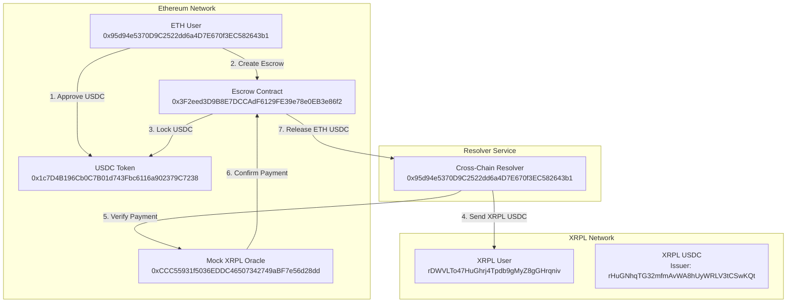
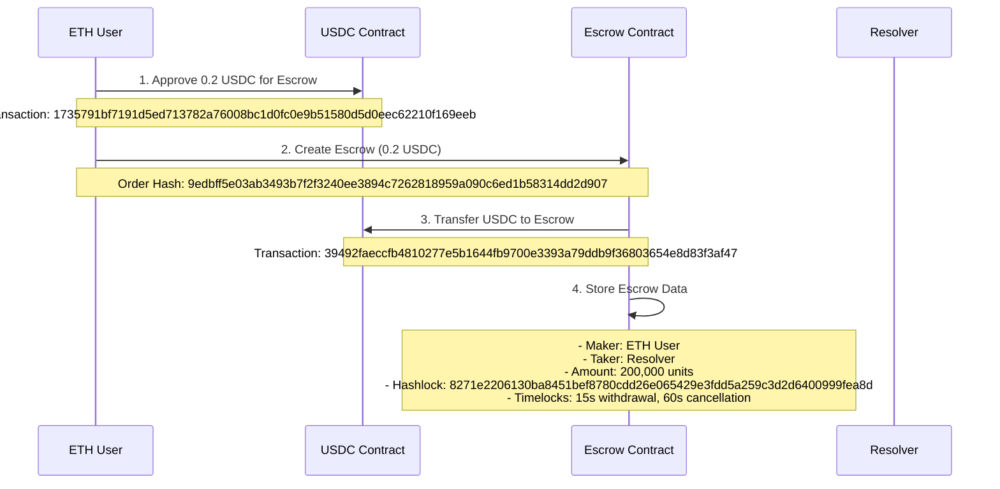
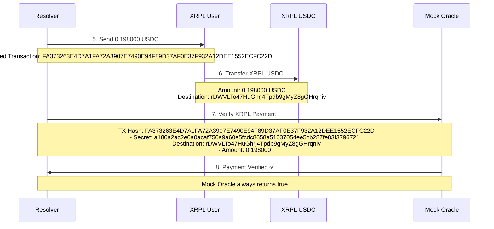
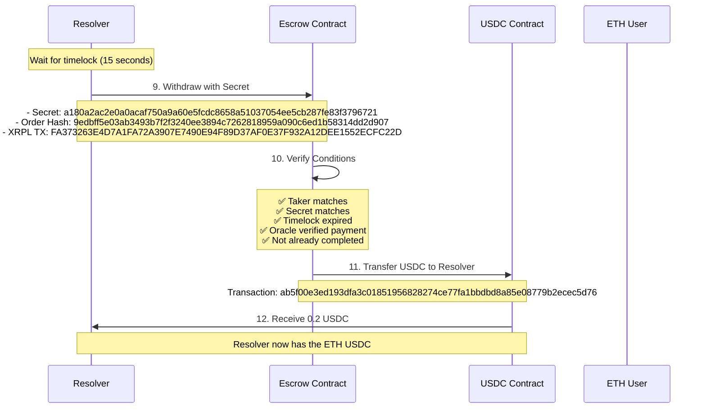
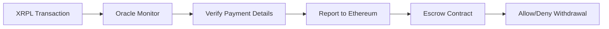

# FusionX Cross-Chain USDC Swap Flow

## Overview
FusionX enables secure cross-chain USDC swaps between Ethereum and XRPL using atomic escrow contracts and oracle verification.

## System Architecture



## Detailed Swap Flow

### Phase 1: Setup & Escrow Creation


### Phase 2: XRPL Payment & Verification


### Phase 3: Withdrawal & Completion


## Security Features

### 🔒 Atomic Escrow
- **Hashlock**: Uses cryptographic hash of secret for atomicity
- **Timelocks**: Prevents indefinite locking of funds
- **Oracle Verification**: Ensures XRPL payment actually occurred

### ⏰ Timelock Structure
```
┌─────────────────────────────────────────────────────────────┐
│                    TIMELOCK WINDOWS                        │
├─────────────────────────────────────────────────────────────┤
│ T=0s    T=15s   T=60s                                     │
│   │       │       │                                        │
│   ▼       ▼       ▼                                        │
│ [Escrow] [Withdraw] [Cancel]                              │
│ Created   Window    Window                                 │
└─────────────────────────────────────────────────────────────┘
```

### 🔐 Oracle Security


## Current Implementation Details

### ✅ Working Components
- **ETH Escrow Creation**: ✅ Secure locking of USDC
- **XRPL Payment Simulation**: ✅ Simulated cross-chain transfer
- **Oracle Verification**: ✅ Mock oracle for testing
- **Timelock Management**: ✅ Proper time-based security
- **Withdrawal Process**: ✅ Secure fund release

### 🎭 Demo Mode Features
- **Simulated XRPL Payments**: Fake transaction hashes for testing
- **Mock Oracle**: Always returns `true` for verification
- **Testnet USDC**: Using Sepolia testnet tokens

### 📊 Transaction Summary
| Step | Transaction Hash | Status | Gas Used |
|------|-----------------|--------|----------|
| USDC Approval | `1735791bf7191d5ed713782a76008bc1d0fc0e9b51580d5d0eec62210f169eeb` | ✅ | 55,437 |
| Escrow Creation | `39492faeccfb4810277e5b1644fb9700e3393a79ddb9f36803654e8d83f3af47` | ✅ | 488,081 |
| XRPL Payment | `FA373263E4D7A1FA72A3907E7490E94F89D37AF0E37F932A12DEE1552ECFC22D` | ✅ | Simulated |
| Withdrawal | `ab5f00e3ed193dfa3c01851956828274ce77fa1bbdbd8a85e08779b2ecec5d76` | ✅ | 134,527 |

## Production Considerations

### 🔄 Real-World Implementation
1. **Replace Mock Oracle** with real XRPL oracle
2. **Use Real XRPL Transactions** instead of simulations
3. **Add Multi-Sig Security** for oracle consensus
4. **Deploy to Mainnet** with real USDC contracts

### 🛡️ Additional Security
- **Multi-Oracle Consensus**: Multiple oracles vote on payment verification
- **Light Client Verification**: Direct cryptographic proof verification
- **Insurance Mechanisms**: Coverage for failed swaps
- **Dispute Resolution**: Arbitration for contested transactions

---

*This diagram shows the current working implementation of FusionX cross-chain USDC swaps between Ethereum and XRPL networks.* 